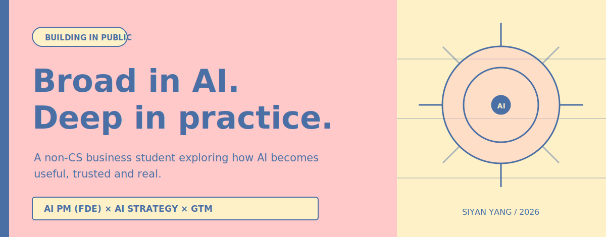

<div align="center">
  
</div>

## A non-CS business student, deep in AI.

I explore AI from three connected angles:

### AI PM (FDE)

Turning ambiguous user needs into useful AI systems. I work close to the problem, prototype fast, and care about whether an AI product remains understandable and reliable outside the demo.

### AI Strategy

Studying how models, agents, data and workflows reshape products and organizations. I am especially interested in capability boundaries, Agent Harnesses and long-horizon collaboration.

### GTM

Finding the sharpest path from emerging capability to real adoption: who needs it, why now, what earns trust, and how a product becomes part of everyday work.

## Things I Build

I build small, opinionated AI products around problems I want to understand more deeply. Each one is both a usable tool and a research question made tangible.

The current selection is pinned below. More experiments are being prepared for release.

## Building in Public

I share work before it feels finished: the product decisions, failed assumptions, system constraints and lessons that usually disappear behind a polished launch.

```text
OBSERVE  ->  FORM A POINT OF VIEW  ->  BUILD  ->  SHIP  ->  LEARN IN PUBLIC
```

**Now exploring**

- How Agent Harnesses turn model capability into reliable product behavior
- How proactive agents maintain context across long-running tasks
- How non-technical builders can develop real leverage without pretending the technical layer does not matter

<div align="center">
  <sub>Broad in AI. Deep in practice. Building in public.</sub>
</div>
